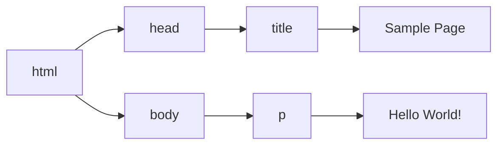

# 什么是JavaScript
## 1.2 JavaScript实现
$$
完整的JavaScript实现 \left \{ \begin{matrix} ECMAScript(核心) \\DOM(文档对象模型) \\BOM(浏览器对象模型) \end{matrix} \right.

$$

- ECMAScript: 由ECMA-262定义并提供核心功能
- DOM:提供与<mark>网页内容</mark> 交互的方法和接口
- BOM:提供与<mark>浏览器</mark> 交互的方法和接口.

### 1.2.2 DOM
Document Object Model 是一个API,用于在HTML中使用扩展的XML.DOM将整个页面抽象为一组分层节点,HTML或者XML页面的每个组成部分都是一种节点,包含不同的数据.
```html
<html>
    <head>
	    <title>Sample Page</title>
	</head>
	<body>
	    <p> Hello World! </p>
	</body>
</html>
```



DOM 通过创建表示文档的树,让开发者可以随心所欲地控制网页的内容和结构.使用DOM API,可以轻松地删除、添加、替换、修改节点.

# HTML中的JavaScript
## 2.1 < script >元素
### 八个属性:
- asyn
>  可选,表示应该立即开始下载脚本,但不能阻止其他页面动作.只针对外部脚本文件有效.
- charset
- crossorigin
> 可选,配置相关请求的CORS(跨资源共享)设置,默认不使用CORS. =“anonymous”请求不必设置凭据标志. =“use-credentials”设置凭据标志.
- defer
> 可选.表示脚本可以延迟到文档完全被解析和现实之后再执行.只针对外部脚本文件有效.
- integrity
> 可选.允许比对接收到的资源和指定的加密签名以验证子资源完整性(SRI, Subresource Intergrity).如果接收到的资源的资源的签名与这个属性指定的签名不匹配,则页面会报错,脚本不会执行.可以用于确保CDN不会提供恶意内容.
- language (废弃)
- src
> 可选,表示包含要执行的代码的外部文件.
- type
> 可选,代替language,表示代码块中脚本语言的内容类型.


