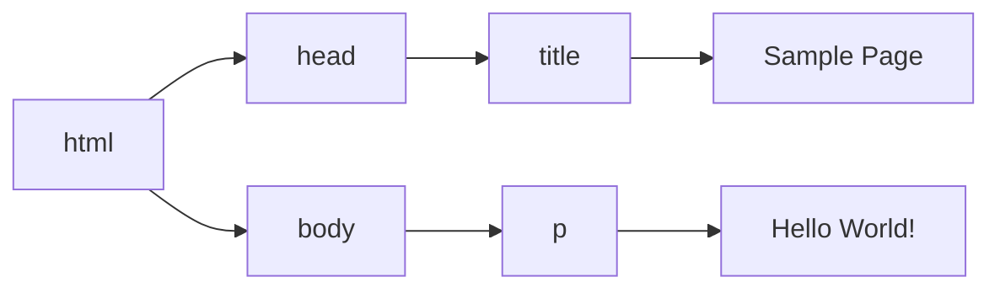

# 什么是JavaScript
## 1.2 JavaScript实现
$$
完整的JavaScript实现 \left \{ \begin{matrix} ECMAScript(核心) \\DOM(文档对象模型) \\BOM(浏览器对象模型) \end{matrix} \right.

$$

- ECMAScript: 由ECMA-262定义并提供核心功能
- DOM:提供与<mark>网页内容</mark> 交互的方法和接口
- BOM:提供与<mark>浏览器</mark> 交互的方法和接口.

### 1.2.2 DOM
Document Object Model 是一个API,用于在HTML中使用扩展的XML.DOM将整个页面抽象为一组分层节点,HTML或者XML页面的每个组成部分都是一种节点,包含不同的数据.
```html
<html>
    <head>
	    <title>Sample Page</title>
	</head>
	<body>
	    <p> Hello World! </p>
	</body>
</html>
```



DOM 通过创建表示文档的树,让开发者可以随心所欲地控制网页的内容和结构.使用DOM API,可以轻松地删除、添加、替换、修改节点.

# HTML中的JavaScript
## 2.1 <script>元素
### 八个属性:
- async:
> 
<++>
